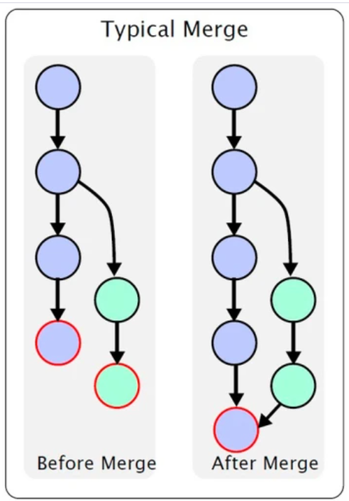

# *8. Объединение ветвей*



## &nbsp;

### 8.1. Внести коммиты из другой ветки в текущую

```bash
git merge [наименование]
```

### 8.2. Принять коммиты своей ветки поверх указанной

```bash
git rebase[наименование] 
```

[вернуться к оглавлению](readme.md)